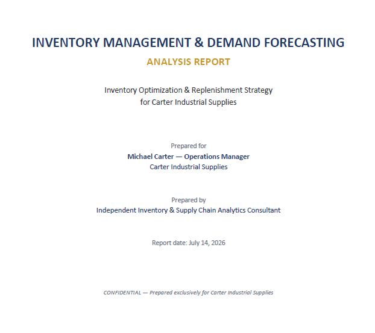
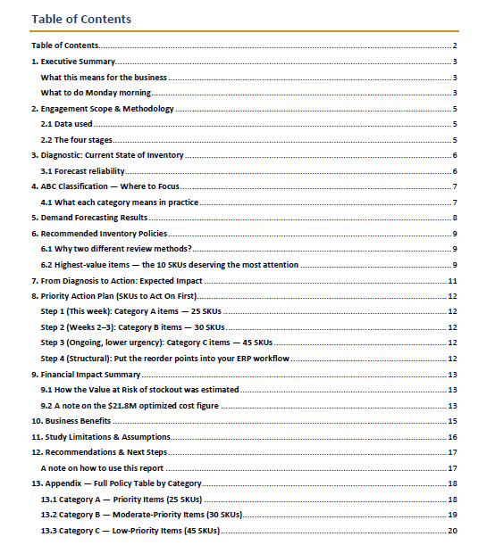
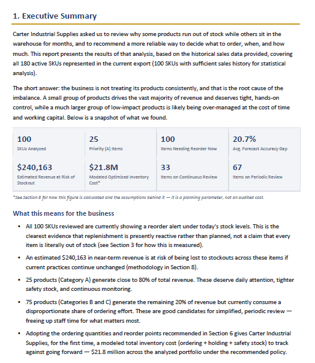

# Inventory Optimization Consulting Case Study

## About this case study

End-to-end inventory optimization consulting case study demonstrating demand analysis, forecasting, inventory policy design, and executive reporting for a fictional wholesale distributor. This case study was developed as part of a professional consulting portfolio to demonstrate the methodology and deliverables used in inventory optimization projects for manufacturing, wholesale and distribution companies.

<p align="center">
  
</p>

## Project Overview

This repository presents a fictional inventory optimization consulting engagement developed to demonstrate a complete, data-driven methodology for improving inventory management and replenishment decisions.

The case study simulates a wholesale distributor experiencing stock imbalances, including recurring stockouts, excess inventory, and inconsistent replenishment practices. Using historical sales data, the project applies demand analysis, forecasting techniques, inventory classification, and replenishment policy design to generate actionable business recommendations.

Although the case study uses fictional data created exclusively for demonstration purposes, the methodology, analytical approach, and consulting deliverables reflect the structure of a real-world inventory optimization engagement.

<p align="center">
  
</p>

## Business Problem

The fictional client was facing several inventory management challenges:

- Frequent stockouts affecting customer service.
- Excess inventory tied up in slow-moving products.
- Lack of a structured demand forecasting process.
- Replenishment decisions based primarily on historical experience rather than analytical methods.
- No standardized inventory policies across SKUs.

The objective of the engagement was to analyze historical demand patterns and develop inventory policies that support more informed replenishment decisions.

## Project Objectives

- Analyze historical sales data.
- Classify products using ABC analysis.
- Evaluate demand behavior by SKU.
- Apply forecasting models where appropriate.
- Design inventory policies based on demand characteristics.
- Generate executive recommendations to improve inventory management.


## Consulting Methodology

The project follows a structured consulting workflow designed to transform raw operational data into actionable inventory management recommendations.

The methodology consists of the following stages:

1. Data validation and cleaning
2. Exploratory data analysis
3. Demand characterization
4. ABC inventory classification
5. Demand forecasting model selection
6. Forecast generation and model evaluation
7. Inventory policy optimization
8. Executive reporting and business recommendations

This workflow combines statistical analysis with engineering judgment to support inventory decisions that are aligned with each product's demand behavior and business importance.


## Deliverables

This repository includes the main deliverables generated during the consulting engagement:

- Executive consulting report (PDF)
- Inventory optimization results workbook (Excel)
- ABC classification
- Demand forecasting results
- Inventory policy recommendations
- Executive summary of findings


## Project Highlights

The analysis produced the following high-level findings:

- 100 SKUs analyzed using historical sales data.
- ABC classification to prioritize inventory management efforts.
- Demand forecasting applied where sufficient historical patterns were available.
- Inventory policies tailored according to demand behavior and business importance.
- Executive recommendations designed to improve replenishment decisions and inventory control.

Rather than providing a one-size-fits-all solution, the methodology adapts forecasting and inventory policies to the characteristics of each SKU, supporting more informed operational decisions.

<p align="center">
  
</p>

## Tools and Technologies:

- Python
- Google Colab
- Pandas
- NumPy
- Matplotlib
- OpenPyXL
- Microsoft Excel


## Repository Structure


```text
inventory-optimization-case-study/
│
├── Case_Study/
│   └── Inventory_Optimization_Report.pdf
│
├── Deliverables/
│   └── Inventory_Optimization_Results.xlsx
│
├── Images/
│
└── README.md
```


## Disclaimer:

This repository presents a fictional business case created exclusively to demonstrate an inventory optimization consulting methodology.

The company, operational data, and business scenario are fictional. However, the analytical workflow, consulting process, and deliverables reflect the structure of a real-world inventory optimization engagement.

No proprietary client information is included in this repository.


## Repository Contents

This repository contains:

- A complete consulting report (PDF)
- Inventory optimization deliverables (Excel)
- Documentation describing the consulting methodology

The analytical code used to generate these deliverables is intentionally not included. The purpose of this repository is to demonstrate the consulting process, analytical approach, and reporting quality delivered to clients.
